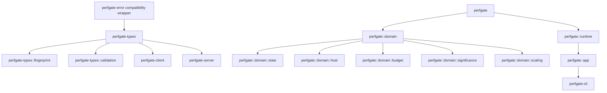

# Perfgate Workspace Inventory

This file is automatically generated by `cargo run -p xtask -- docs-sync`.

## Micro-crates

| Crate | Description | Kill Rate Target |
|-------|-------------|------------------|
| `perfgate-error` | Compatibility wrapper for perfgate_types::error | 100% |
| `perfgate-export` | Workspace-only compatibility wrapper for perfgate::presentation::export | 90% |
| `perfgate-render` | Workspace-only compatibility wrapper for perfgate::presentation::render | 90% |
| `perfgate-sensor` | Workspace-only compatibility wrapper for perfgate::presentation::sensor | 90% |
| `perfgate-adapters` | Workspace-only compatibility wrapper for perfgate::runtime | 90% |
| `perfgate-github` | Workspace-only compatibility wrapper for perfgate::integrations::github | 90% |
| `perfgate-domain` | Workspace-only compatibility wrapper for perfgate::domain | 100% |
| `perfgate-app` | Workspace-only compatibility wrapper for perfgate::app | 90% |
| `perfgate-paired` | Workspace-only compatibility wrapper for perfgate::domain::paired | 100% |
| `perfgate-fake` | Test utilities and fake implementations | 70% |

## Core Crates

| Crate | Description | Kill Rate Target |
|-------|-------------|------------------|
| `perfgate-types` | Receipt/config structs, JSON schema types | 95% |
| `perfgate-cli` | CLI argument parsing and command dispatch | 70% |
| `perfgate-server` | REST API server for baseline management | 90% |
| `perfgate-client` | API client for baseline server interaction | 90% |
| `perfgate` | Facade with domain, app, runtime, and presentation modules | 90% |

## Dependency Flow

