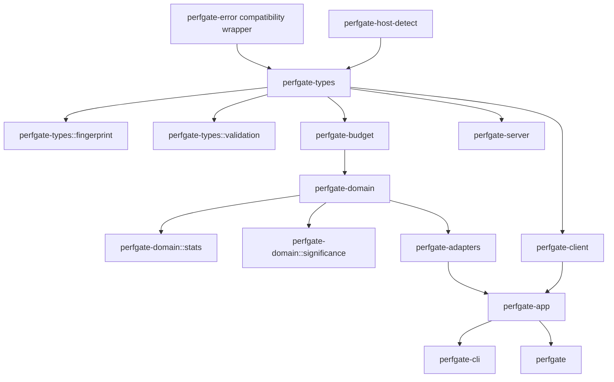

# Perfgate Workspace Inventory

This file is automatically generated by `cargo run -p xtask -- docs-sync`.

## Micro-crates

| Crate | Description | Kill Rate Target |
|-------|-------------|------------------|
| `perfgate-error` | Compatibility wrapper for perfgate_types::error | 100% |
| `perfgate-host-detect` | Host mismatch detection for CI noise reduction | 100% |
| `perfgate-budget` | Budget evaluation logic for performance thresholds | 100% |
| `perfgate-export` | Export formats (CSV, JSONL, HTML, Prometheus) | 90% |
| `perfgate-render` | Markdown and GitHub annotations rendering | 90% |
| `perfgate-sensor` | Sensor report builder for cockpit integration | 90% |
| `perfgate-paired` | Paired benchmarking statistics (A/B testing) | 100% |
| `perfgate-fake` | Test utilities and fake implementations | 70% |

## Core Crates

| Crate | Description | Kill Rate Target |
|-------|-------------|------------------|
| `perfgate-types` | Receipt/config structs, JSON schema types | 95% |
| `perfgate-domain` | Pure math/policy (I/O-free) | 100% |
| `perfgate-adapters` | Platform I/O (process execution, host probing) | 80% |
| `perfgate-app` | Use-cases, orchestration layer | 90% |
| `perfgate-cli` | CLI argument parsing and command dispatch | 70% |
| `perfgate-server` | REST API server for baseline management | 90% |
| `perfgate-client` | API client for baseline server interaction | 90% |
| `perfgate` | Unified facade library | 90% |

## Dependency Flow

